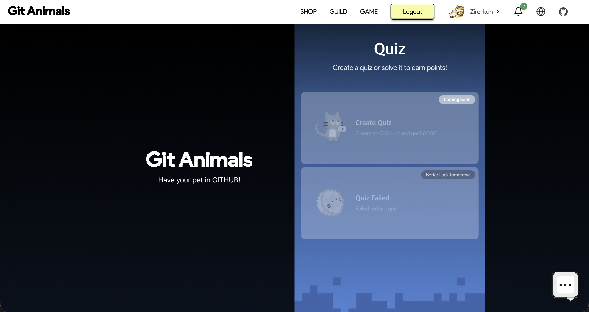
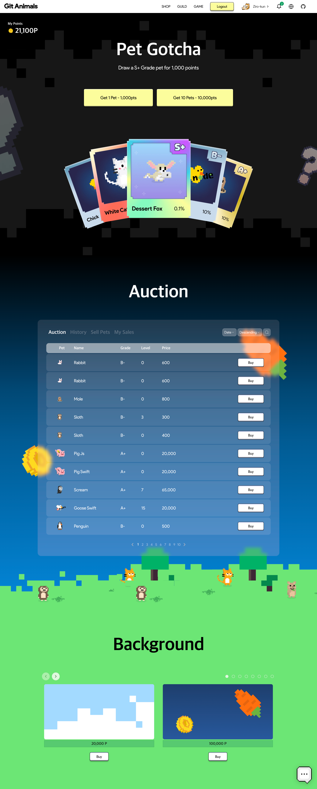

# 0. 들어가며

포트폴리오 페이지에 붙인 hits 카운터의 showcase를 확인하다가 상위 랭킹에 뭔가 귀여운 이미지가 눈에 띄었습니다.

> "어? 이게 뭐지? 왜 이렇게 귀여운데?"

그렇게 깃애니멀과의 만남이 시작되었습니다.

---

# 1. 깃애니멀이 뭐길래

깃애니멀의 원리는 간단합니다. **깃허브에 커밋(기여)하면 캐릭터가 자란다**는 개념이에요.

- 레포지토리에 기여할 때마다 경험치를 얻고
- 캐릭터가 점점 성장하고
- 나만의 농장을 꾸밀 수 있다

처음엔 "아, 그냥 찍먹해봐?" 정도였는데... 시작한 지 10분 만에 생각이 바뀌었습니다.

---

# 2. 길드 시스템 — 혼자가 아니다

깃애니멀의 진짜 매력은 **길드 시스템**입니다.

우리 부트캠프 팀원들을 모두 길드에 초대했어요. 이제 혼자가 아니라는 뜻이죠.

> "아, 요즘 팀원들이 열심히 커밋하네!"

길드 채널에서 팀원들의 성장을 보면서 자연스럽게 동기부여가 됩니다. 마치 같은 팀 게임을 하는 것처럼요.

---

# 3. 캐릭터만 보여주는 것이 아니다.

보다보니 생각보다 시스템이 탄탄했습니다.

### 📊 다양한 디스플레이 옵션

- 농장 형태로 보기
- 단일 라인 형태로 보기
- 개별 캐릭터별로 보기

포트폴리오나 리드미에 넣을 수 있는 여러 형식들이 있어서, 취향대로 골라 쓸 수 있어요.

### 🎮 퀴즈 시스템

매일 한 번씩 할 수 있는 퀴즈가 있습니다. 포인트를 번다는 게 뭔가 중독적이더라고요. 매일의 작은 보상이 쌓이면서 동기부여가 됩니다. 심지어 LLM 도 못돌리게 5초 안에 답을 못하면 오답처리 되어요.

### 💰 경제 시스템

경제 시스템도 존재합니다.

포인트를 모으면:

- 캐릭터를 뽑을 수 있고 (가챠)
- 내 캐릭터를 팔 수도 있고
- 농장의 배경을 꾸밀 수도 있다

처음엔 단순한 시스템이라고 생각했는데, 알면 알수록 **정말 잘 만들어진 서비스**라는 생각이 듭니다.

---

# 4. 마치며

깃애니멀은 단순한 깃허브 통계 시각화 도구가 아닙니다.

개발자들의 **커밋 활동을 게임처럼 만든** 정말 영리한 서비스입니다. 그리고 길드 시스템으로 혼자가 아닌 함께하는 경험을 제공한다는 게 정말 매력적으로 느껴졌습니다.

그리고 일단 도트 캐릭터가 너무 귀여워요.

> 이런 서비스들을 보면 알 수 있습니다. 개발자들은 **귀여운 것**을 좋아한다는걸.

혹시 아직 깃애니멀을 모르셨다면, 지금 바로 들어가 보세요. 저랑 저희 동기들처럼 매일 한번씩 퀴즈도 풀고 가챠도 돌리게 되실 겁니다. ~~_중독성 주의_~~
