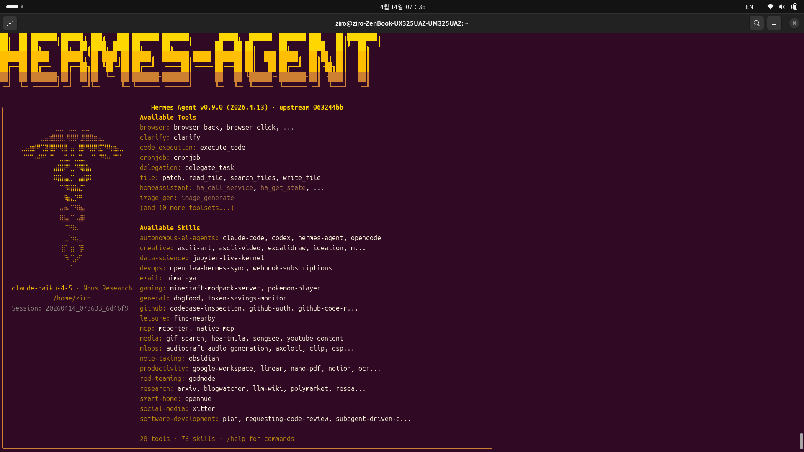
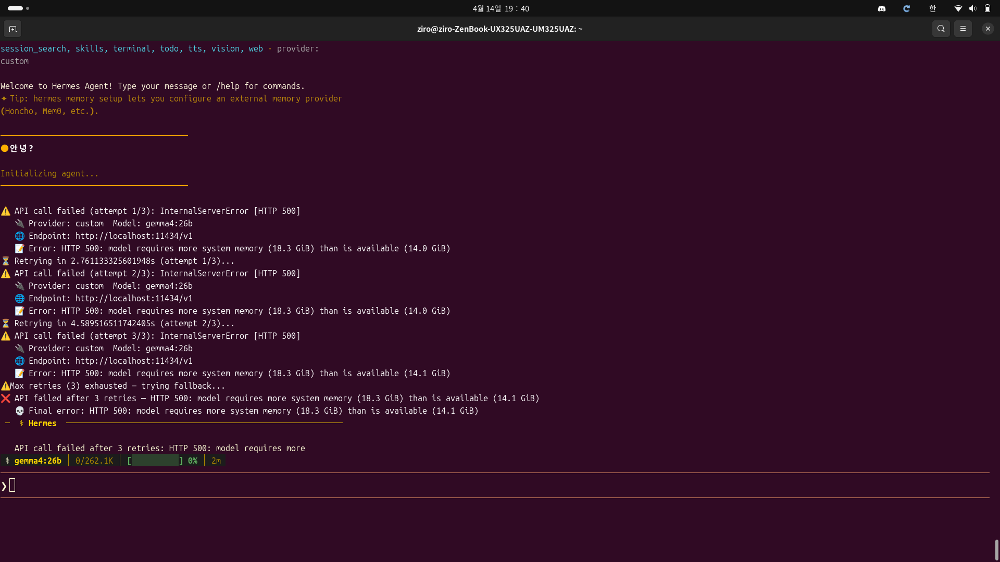
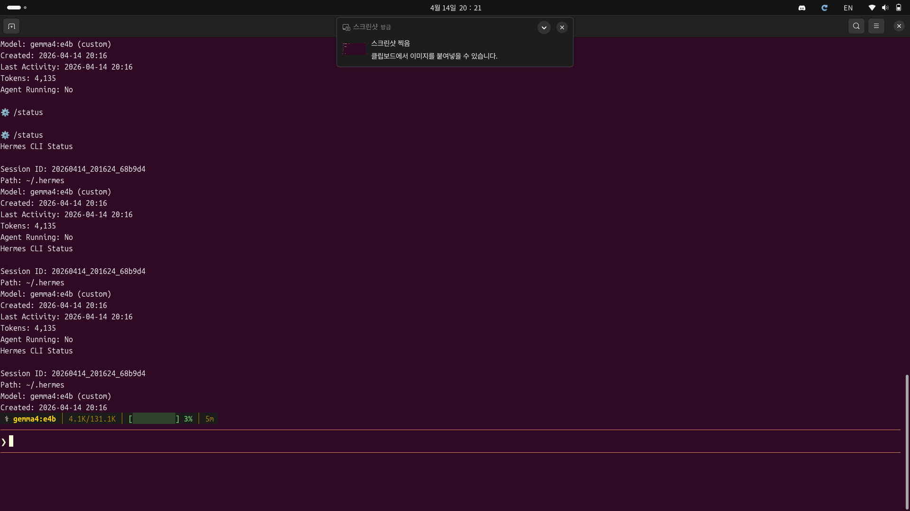
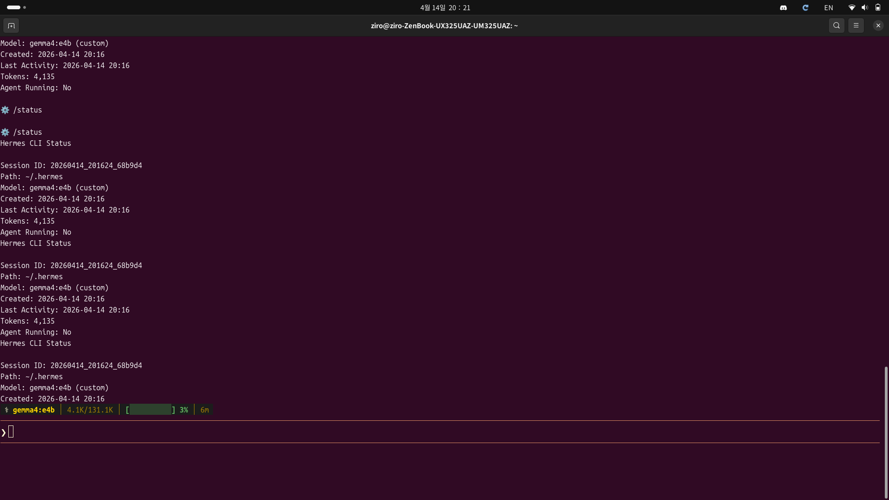
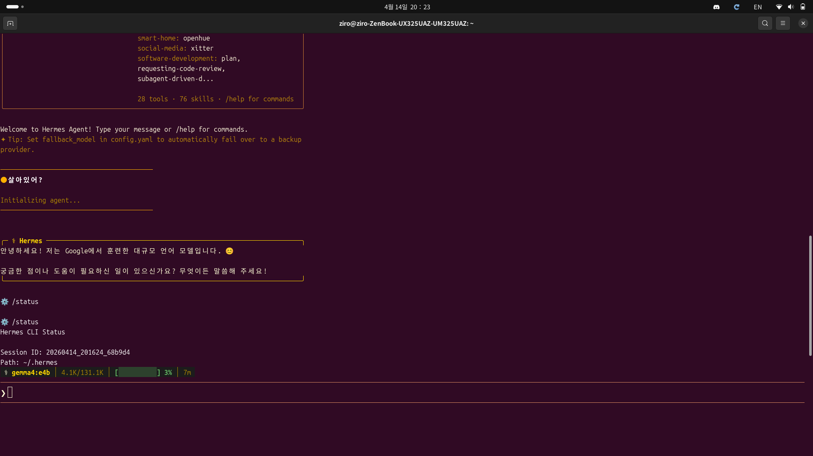
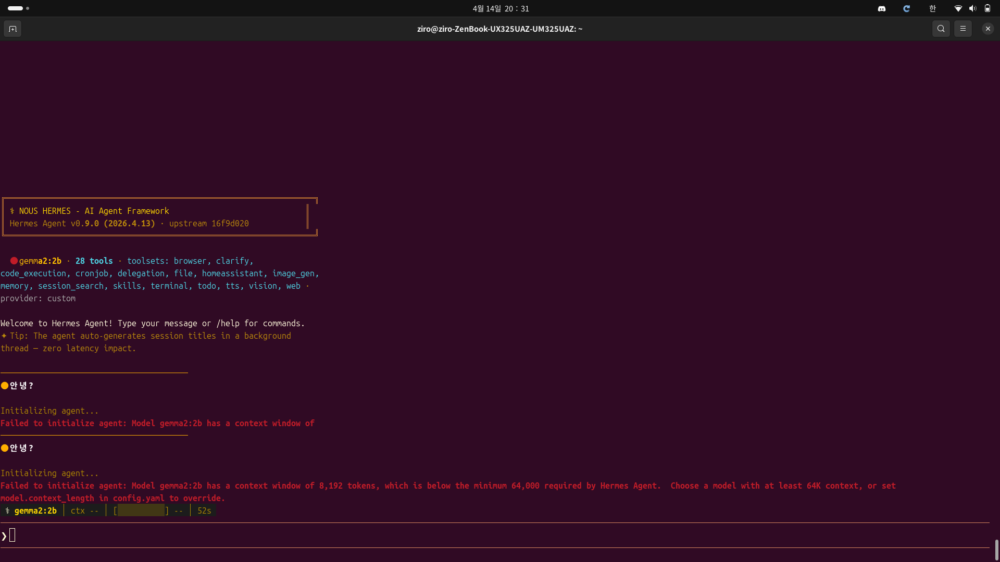
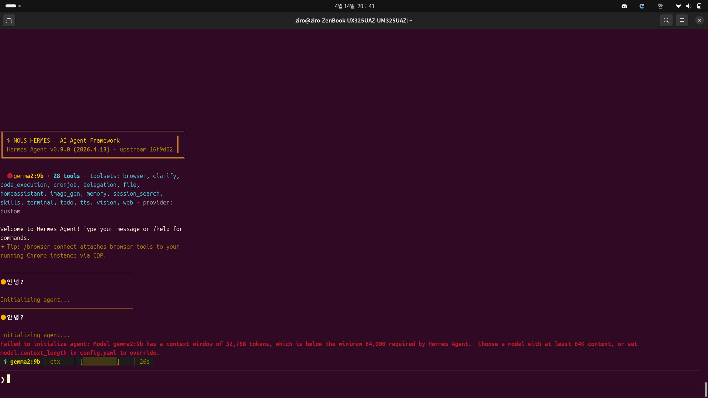
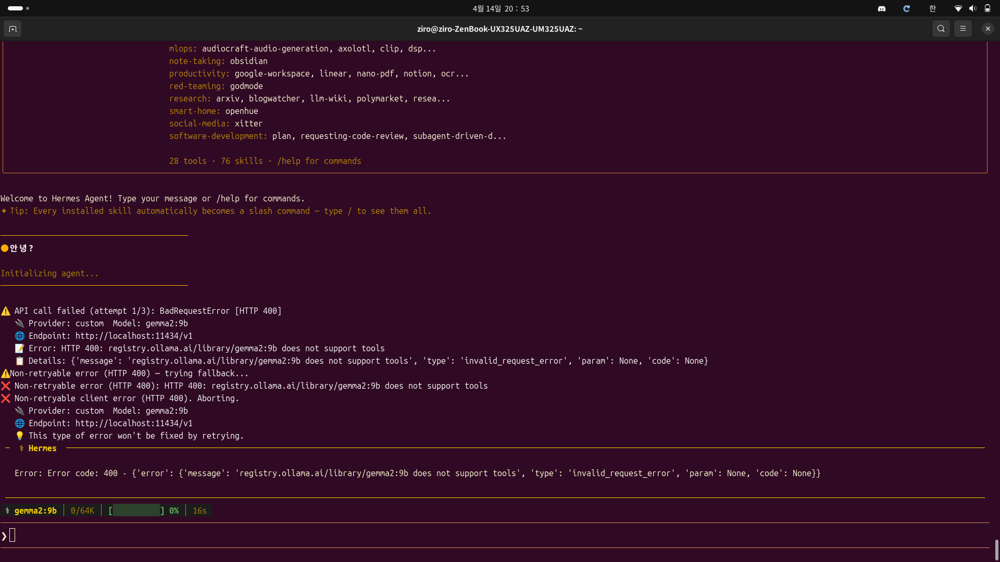

# 0. 들어가며

> Gemma 모델 파일만 있으면 되지 않을까?

처음엔 정말 단순하게 생각했습니다. 모델 파일을 다운받으면 바로 실행할 수 있을 거라고요. 하지만 현실은 그렇게 호락호락하지 않았습니다. 

LLM 모델을 실행하려면 단순히 모델 파일만으로는 부족합니다. **추론 엔진(Inference Engine)**이 필요하거든요. 이게 뭐냐면, 모델을 메모리에 로드하고, GPU를 활용해 실제로 계산을 처리하고, API 서버까지 띄워주는 녀석들입니다.

제가 Gemini와 대화하면서 정리한 내용을 바탕으로, 우분투 환경에서 **Ollama**라는 추론 엔진을 통해 **Gemma 모델**을 실행하고, 이를 **Hermes Agent**와 연동하는 방법을 알려드리겠습니다.

---

# 1. 추론 엔진이란?

## 왜 필요한가?

모델 파일(`.gguf`, `.safetensors` 등)은 그냥 가중치 데이터일 뿐입니다. 이걸 실제로 추론(inference)하려면:

- 모델을 GPU/CPU 메모리에 로드
- 입력값을 처리
- 계산 수행
- 결과 반환

이 모든 과정을 담당하는 게 추론 엔진입니다.

## 주요 선택지

| 엔진 | 특징 | 추천 대상 |
|------|------|---------|
| **Ollama** | 모든 걸 자동으로 처리, 가장 간단 | 입문자, 빠른 구성 |
| **vLLM** | 높은 처리량, 성능 최적화 | 대규모 배포, 성능 중시 |
| **LM Studio** | GUI 제공, 매우 직관적 | GUI 선호자 |
| **Text Generation WebUI** | 기능 많음, 커스터마이징 가능 | 고급 사용자 |

저는 **Ollama**를 추천합니다. 설치부터 실행까지 정말 간단하거든요.

> Ollama는 "모델 다운로드 → 메모리 로드 → API 서버 생성"을 한 번에 처리해줍니다.

---

# 2. 사전 준비물

우분투 환경에서 시작하기 전에 확인하세요:

- **Ubuntu 20.04 LTS 이상** (저는 22.04 사용)
- **GPU 메모리 8GB 이상** (Gemma 7b 기준)
  - CPU로도 가능하지만, 응답 속도가 매우 느립니다
- **인터넷 연결** (모델 다운로드용)
- **sudo 권한**

GPU 확인 명령어:

```bash
nvidia-smi
```

이 명령어가 안 먹으면 NVIDIA 드라이버를 먼저 설치해야 합니다.

---

# 3. Ollama 설치 및 Gemma 모델 실행

## 3.1 Ollama 설치

우분투에서 Ollama를 설치하는 건 정말 간단합니다:

```bash
curl -fsSL https://ollama.ai/install.sh | sh
```

이 한 줄이면 끝입니다. 설치 후 확인:

```bash
ollama --version
```


~~_Ollama가 정말 한 줄로 설치되네요_~~

## 3.2 Gemma 모델 실행

Ollama가 설치되면, 이제 Gemma 모델을 실행합니다:

```bash
ollama run gemma:7b
```

처음 실행하면:

1. Ollama 공식 레지스트리에서 모델을 **자동 다운로드**
2. 모델을 **메모리에 로드**
3. **API 서버 자동 시작** (기본값: http://localhost:11434)

~~(진짜 이게 다입니다)~~


~~_첫 실행 후 모델이 준비되는 모습_~~

> "Send a message (/? for help)" 이 메시지가 나오면 성공입니다.

테스트 메시지를 입력해보세요:

```
Hello, what is 2+2?
```

모델이 답변하면 완벽하게 작동하는 겁니다.

## 3.3 모델 선택 가이드

하드웨어 사양에 따라 선택하세요:

| 모델 | 메모리 | 속도 | 성능 |
|------|--------|------|------|
| `gemma:2b` | 4GB | 빠름 | 낮음 |
| `gemma:7b` | 8GB | 중간 | 중간 |
| `gemma2:9b` | 12GB | 중간 | 높음 |
| `gemma2:27b` | 24GB 이상 | 느림 | 매우 높음 |

저는 **gemma:7b**를 추천합니다. 대부분의 작업에 충분하거든요.

다른 모델을 실행하려면:

```bash
ollama run gemma2:9b
```

---

# 4. Hermes Agent 설치 및 설정

## 4.1 Hermes Agent란?

Hermes Agent는 LLM을 기반으로 한 **자율 에이전트 프레임워크**입니다. 복잡한 작업을 단계적으로 분해하고, 도구를 활용해 문제를 해결하는 능력이 있습니다.

## 4.2 설치

```bash
pip install hermes-agent
```

또는 GitHub에서 최신 버전을 설치:

```bash
git clone https://github.com/your-repo/hermes-agent.git
cd hermes-agent
pip install -e .
```


~~_pip install 진행 중_~~

## 4.3 모델 연동 설정

Hermes Agent를 Ollama의 Gemma 모델과 연결하려면:

```bash
hermes setup
```

이 명령어를 실행하면 대화형 설정이 시작됩니다:

```
? Model provider: ollama
? Model name: gemma:7b
? API endpoint: http://localhost:11434
```

각 항목을 입력하면 설정이 저장됩니다.


~~_설정 마법사가 친절하네요_~~

설정 파일은 보통 `~/.hermes/config.yaml`에 저장됩니다.

---

# 5. 실행 및 테스트

## 5.1 Hermes Agent 실행

기본 실행:

```bash
hermes
```

또는 특정 작업 지정:

```bash
hermes --task "Write a Python function to sort a list"
```


~~_Hermes가 작업을 단계적으로 처리하는 모습_~~

## 5.2 API 서버로 실행

Hermes를 백그라운드 서비스로 실행하려면:

```bash
hermes server --port 8000
```

이제 다른 애플리케이션에서 HTTP 요청으로 접근할 수 있습니다:

```bash
curl -X POST http://localhost:8000/chat \
  -H "Content-Type: application/json" \
  -d '{"message": "Hello, Hermes!"}'
```


~~_API 서버가 정상 작동 중_~~

---

# 6. 주의사항 및 트러블슈팅

## 6.1 GPU 메모리 부족

**증상**: `CUDA out of memory` 에러

**해결방법**:
- 더 작은 모델 사용: `gemma:2b` 또는 `gemma:7b`
- CPU 모드로 실행: `OLLAMA_CPU_ONLY=1 ollama run gemma:7b`
- 다른 프로세스 종료

```bash
nvidia-smi
# 메모리 사용 현황 확인
```


~~_nvidia-smi로 상태를 확인하면 도움이 됩니다_~~

## 6.2 포트 충돌

**증상**: `Address already in use` 에러

**해결방법**:
```bash
# 포트 11434 사용 중인 프로세스 확인
lsof -i :11434

# 다른 포트로 실행
OLLAMA_HOST=127.0.0.1:11435 ollama serve
```

## 6.3 권한 문제

**증상**: Permission denied 에러

**해결방법**:
```bash
# Ollama 그룹에 현재 사용자 추가
sudo usermod -aG ollama $USER

# 새 세션 시작 (로그아웃 후 로그인)
newgrp ollama
```

## 6.4 느린 응답 속도

**원인**: CPU 모드로 실행 중일 가능성

**확인**:
```bash
ollama list
# STATUS 확인 - "loaded in 10s" 같은 표시가 있으면 정상
```

GPU 사용 확인:
```bash
watch nvidia-smi
# Ollama 프로세스가 GPU 메모리 사용 중인지 확인
```


~~_GPU 활용 상태를 실시간으로 모니터링_~~

---

# 7. 심화 설정

## 7.1 Ollama 서비스 자동 시작

우분투 시스템 부팅 시 Ollama를 자동으로 시작하려면:

```bash
sudo systemctl enable ollama
sudo systemctl start ollama

# 상태 확인
sudo systemctl status ollama
```


~~_systemctl로 서비스 관리가 가능합니다_~~

## 7.2 모델 메모리 최적화

대규모 모델을 실행할 때 메모리 사용량을 줄이려면:

```bash
# 4-bit 양자화 모델 사용
ollama run gemma2:9b-q4_K_M
```

`-q4_K_M` 같은 접미사는 **양자화(Quantization)** 레벨을 나타냅니다:

- `q4`: 4-bit (가장 작음, 약간의 성능 손실)
- `q5`: 5-bit (중간)
- `q8`: 8-bit (거의 손실 없음)

## 7.3 여러 모델 동시 실행

Ollama는 한 번에 하나의 모델만 메모리에 로드합니다. 하지만 빠르게 전환할 수 있습니다:

```bash
# 모델 1 실행
ollama run gemma:7b

# 다른 터미널에서
ollama run mistral:7b
# (자동으로 이전 모델을 언로드하고 새 모델 로드)
```

---

# 8. 실제 사용 예시

## 8.1 Python에서 Hermes Agent 사용

```python
from hermes_agent import Agent

agent = Agent(model="gemma:7b", provider="ollama")

# 간단한 질문
response = agent.ask("What is the capital of France?")
print(response)

# 복잡한 작업 (도구 활용)
response = agent.execute_task(
    "Find the weather in Seoul and write a summary"
)
print(response)
```


~~_Python에서 에이전트를 쉽게 제어할 수 있습니다_~~

## 8.2 Ollama REST API 직접 사용

```bash
# 간단한 채팅
curl http://localhost:11434/api/chat -