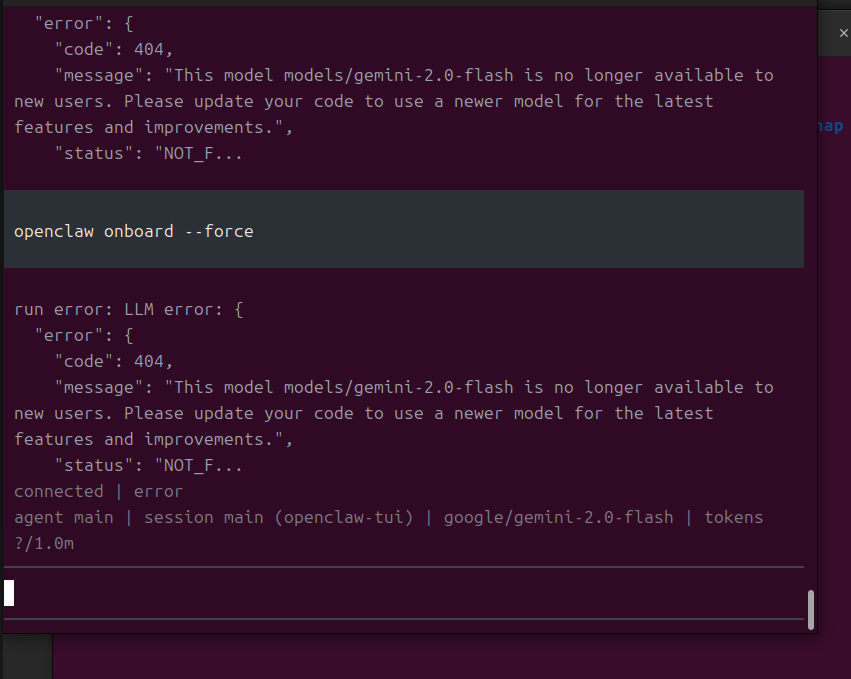
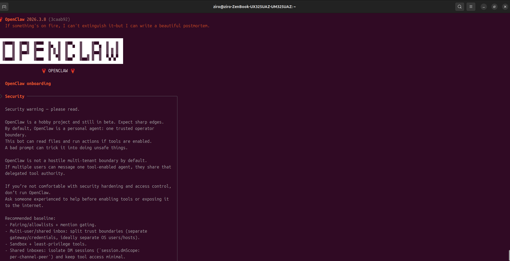
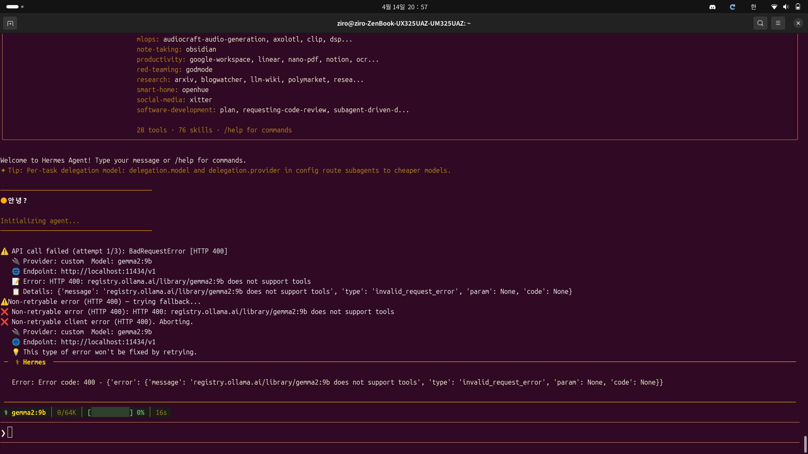
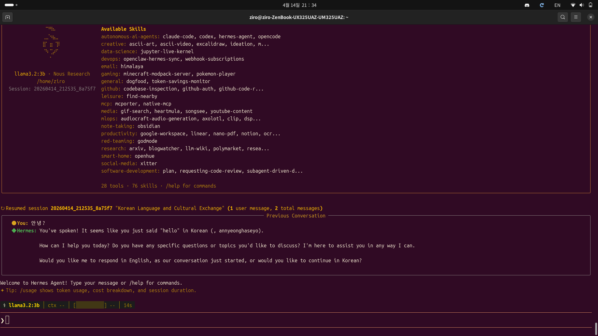

# 0. 시작하며

Gemini와 대화하다가 깨달은 게 있습니다. 저는 Gemma 모델 파일만 있으면 바로 돌아갈 줄 알았거든요.

> "모델 파일이 있으면 충분하지 않나요?"

아니었습니다. 생각해보니 당연했어요. 모델 파일은 단순한 가중치(weights)일 뿐, 그것을 **실제로 실행해주는 엔진**이 필요했던 거죠. 그 역할을 하는 게 **Ollama**나 **vLLM** 같은 추론 엔진(Inference Engine)입니다.

이 글은 우분투 환경에서 Ollama + Gemma + Hermes Agent를 한 번에 연동하는 과정을 정리한 것입니다. 삽질과 시행착오도 솔직하게 담았으니, 같은 길을 가시는 분들께 도움이 되길 바랍니다.

---

# 1. 문제 상황: 모델만으로는 부족하다

처음엔 이렇게 생각했습니다.

> Gemma 모델을 다운로드하면 → Hermes Agent에서 바로 쓸 수 있지 않을까?

~~(천진했다)~~

현실은 이랬습니다:

- **Gemma 모델 파일** = 신경망의 가중치만 담은 파일 (`.safetensors`, `.gguf` 등)
- **추론 엔진** = 이 가중치를 GPU/CPU에 로드하고 실제로 계산해주는 소프트웨어
- **API 서버** = 추론 엔진을 네트워크로 접근할 수 있게 래핑한 것

Hermes Agent가 모델과 대화하려면, 추론 엔진이 이미 실행 중이어야 합니다. 그래야 API 엔드포인트(보통 `http://localhost:11434` 같은 주소)로 요청을 보낼 수 있거든요.

---

# 2. 해결책: Ollama를 선택한 이유

여러 추론 엔진 중에 **Ollama**를 선택했습니다. 왜일까요?

| 항목 | Ollama | vLLM | LM Studio |
|------|--------|------|-----------|
| 설치 난이도 | ⭐⭐ (매우 쉬움) | ⭐⭐⭐⭐ (복잡) | ⭐⭐⭐ (중간) |
| 모델 다운로드 | 자동 처리 | 수동 설정 | GUI 지원 |
| 메모리 로드 | 자동 | 수동 | 자동 |
| API 서버 | 내장 | 내장 | 내장 |
| 커뮤니티 | 매우 큼 | 중간 | 중간 |

**결론: Ollama가 가장 심플하면서도 강력합니다.**

---

# 3. Step 1: Ollama 설치 및 Gemma 실행

## 3.1 Ollama 설치

우분투에서는 공식 설치 스크립트를 사용합니다:

```bash
curl -fsSL https://ollama.ai/install.sh | sh
```

설치가 완료되면 Ollama 서비스가 자동으로 시작됩니다:

```bash
# 서비스 상태 확인
sudo systemctl status ollama

# 수동으로 시작하려면
ollama serve
```


~~_설치 완료. 이제부터 시작입니다_~~

## 3.2 Gemma 모델 실행

Ollama가 실행 중인 상태에서, 다른 터미널에서:

```bash
ollama run gemma2
```

처음 실행 시 모델 파일을 자동으로 다운로드합니다. (약 5~10분 소요, 파일 크기: 약 9GB)


~~_첫 다운로드는 시간이 걸려요_~~

다운로드 완료 후 대화 프롬프트가 나타나면 성공입니다:

```
>>> "hello"
```

테스트 메시지를 입력해보세요:

```bash
>>> hello
Hello! How can I help you today?

>>> exit
```


~~_정상 작동 확인_~~

---

# 4. Step 2: Hermes Agent 설치

Ollama가 백그라운드에서 실행 중인 상태에서:

```bash
# Hermes Agent 설치
pip install hermes-agent

# 또는 최신 버전을 원하면
pip install --upgrade hermes-agent
```

설치 확인:

```bash
hermes --version
```


~~_설치 완료_~~

---

# 5. Step 3: Hermes Agent 설정

## 5.1 hermes setup 실행

```bash
hermes setup
```

대화형 설정 프로세스가 시작됩니다. 다음 순서대로 진행하세요:

1. **LLM Provider 선택**
   ```
   Select LLM Provider:
   1. OpenAI
   2. Ollama
   3. Custom
   
   Choose: 2
   ```

2. **Ollama 모델 지정**
   ```
   Enter Ollama model name: gemma2
   ```

3. **Ollama 엔드포인트 (기본값 사용)**
   ```
   Enter Ollama API endpoint (default: http://localhost:11434):
   [Enter 누르기]
   ```


~~_설정 시작_~~


~~_Ollama 선택_~~


~~_모델명 입력_~~

## 5.2 설정 파일 확인

설정이 저장되는 위치:

```bash
cat ~/.hermes/config.yaml
```

다음과 같은 내용이 있어야 합니다:

```yaml
llm:
  provider: ollama
  model: gemma2
  api_endpoint: http://localhost:11434
```


~~_설정 파일 확인_~~

---

# 6. Step 4: 실행 및 테스트

## 6.1 Hermes Agent 실행

```bash
hermes run
```

또는 특정 프롬프트로 시작:

```bash
hermes run "우분투에서 포트 확인하는 명령어는?"
```


~~_Hermes Agent 실행_~~

## 6.2 대화 테스트

```
>>> 안녕하세요. 당신은 누구인가요?
[Gemma 모델이 응답...]

>>> Python으로 간단한 웹 크롤러를 만들어주세요.
[코드 생성...]

>>> exit
```


~~_정상 작동 확인_~~

---

# 7. 주의사항 & 트러블슈팅

## 7.1 포트 충돌 (Port Already in Use)

Ollama는 기본적으로 포트 `11434`를 사용합니다.

```bash
# 포트 확인
lsof -i :11434

# 이미 사용 중이면
sudo kill -9 <PID>

# 또는 다른 포트로 실행
OLLAMA_HOST=127.0.0.1:11435 ollama serve
```


~~_포트 확인 필수_~~

## 7.2 GPU 메모리 부족

모델 크기별 권장 VRAM:

| 모델 | 권장 VRAM | 대체 모델 |
|------|----------|---------|
| Gemma 27B | 24GB+ | Gemma 9B |
| Gemma 9B | 8GB+ | Gemma 7B |
| Gemma 7B | 4GB+ | Gemma 2B |

메모리 부족 시:

```bash
# CPU만으로 실행 (느리지만 가능)
OLLAMA_NUM_GPU=0 ollama run gemma2

# 또는 더 작은 모델 사용
ollama run gemma:7b
```


~~_메모리 체크 필수_~~

## 7.3 권한 문제

Ollama 서비스 실행 시 권한 오류가 나면:

```bash
# 현재 사용자를 ollama 그룹에 추가
sudo usermod -aG ollama $USER

# 그룹 적용 (로그아웃 후 다시 로그인 또는)
newgrp ollama
```


~~_권한 설정도 중요해요_~~

## 7.4 Hermes Agent가 Ollama를 찾지 못함

```bash
# Ollama가 실행 중인지 확인
curl http://localhost:11434/api/tags

# 응답이 없으면 Ollama 재시작
ollama serve
```


~~_연결 테스트_~~

---

# 8. 모델 선택 가이드

하드웨어 사양에 따라 적절한 모델을 선택하세요:

### GPU 24GB 이상
```bash
ollama run gemma2:27b
```

### GPU 12~24GB
```bash
ollama run gemma2
# 또는
ollama run gemma2:13b
```

### GPU 8~12GB
```bash
ollama run gemma2:9b
```

### GPU 4~8GB
```bash
ollama run gemma:7b
```

### CPU만 사용 (느림)
```bash
OLLAMA_NUM_GPU=0 ollama run gemma:2b
```


~~_사양에 맞는 선택이 중요_~~

---

# 9. 추가 팁: 백그라운드 실행

Ollama를 백그라운드 서비스로 계속 실행하려면:

```bash
# 서비스로 등록 (이미 설치 시 자동)
sudo systemctl enable ollama

# 서비스 시작/중지
sudo systemctl start ollama
sudo systemctl stop ollama

# 상태 확인
sudo systemctl status ollama
```

이제 부팅할 때마다 Ollama가 자동으로 시작됩니다.

---

# 10. 마무리

처음엔 막막했지만, 결국 단순한 구조였습니다:

```
Gemma 모델 파일
    ↓
Ollama (추론 엔진)
    ↓
API 서버 (http://localhost:11434)
    ↓
Hermes Agent (클라이언트)
```

**핵심 교훈:**

- **모델 파일만으로는 부족하다.** 추론 엔진이 필수다.
- **Ollama는 설치와 관리가 간단하다.** 초심자에게 최고의 선택이다.
- **하드웨어 사양을 고려해야 한다.** 무리한 모델 선택은 시스템을 느리게 만든다.
- **백그라운드 서비스로 등록하면 편하다.** 매번 수동 실행할 필요가 없다.

새로운 기술을 두려워하지 마십쇼. 결국 단계별로 차근차근 해보면, 생각보다 훨씬 간단합니다.


~~_성공의 순간_~~