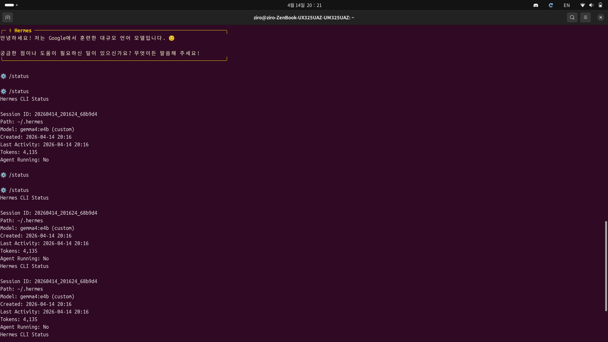
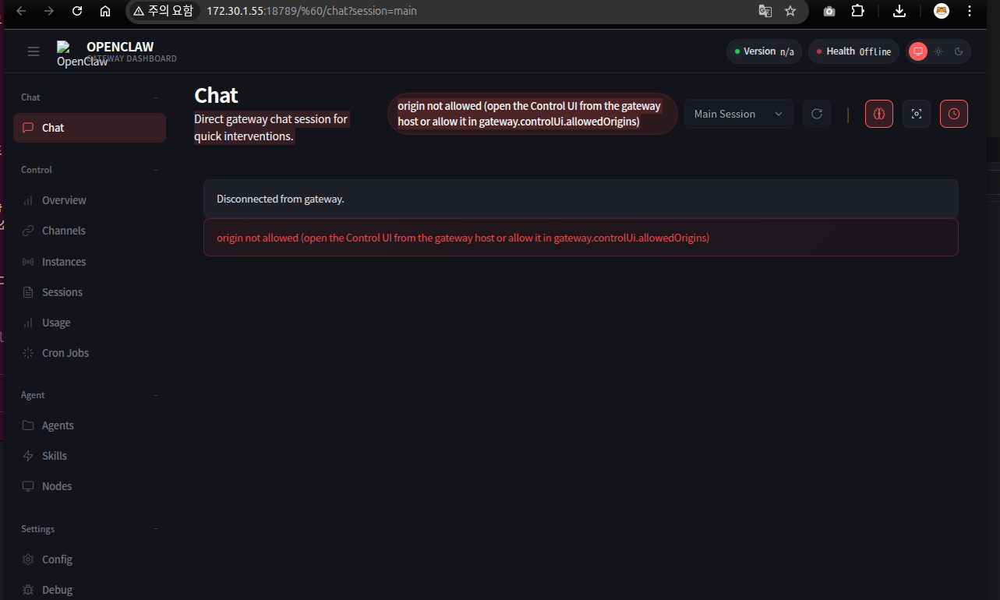
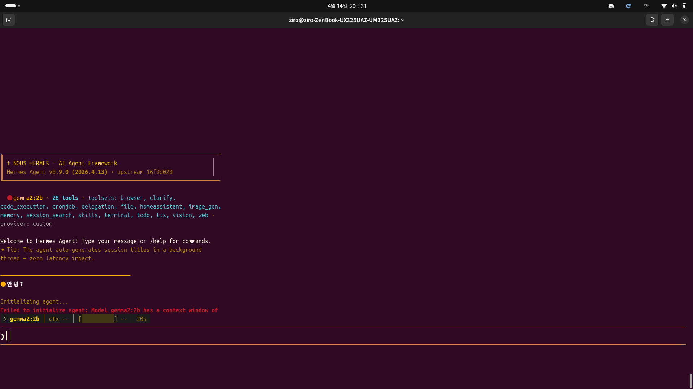
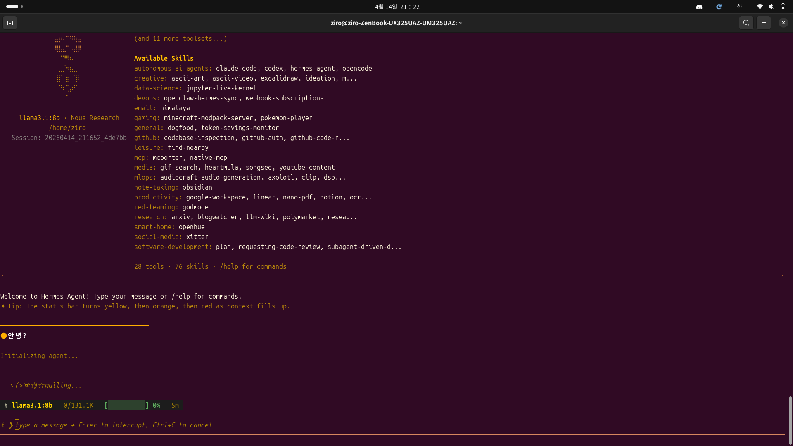

# 0. 들어가며

> 로컬 LLM으로 충분하겠지?

우분투에서 Hermes Agent를 구동하려고 했습니다. Gemma 모델 파일을 받았고, Ollama를 설치했고, Hermes Agent도 설치했습니다. 

모든 준비가 완료되었다고 생각했습니다.

그 생각이 얼마나 순진했는지 깨달아주신 건 4번의 연속 실패였습니다.

---

# 1. 첫 번째 시도: Gemma 4 26B — 메모리의 벽

```
❌ Error: HTTP 500: model requires more system memory 
           (18.3 GiB) than is available (14.1 GiB)
```

당연한 거였어요. ZenBook 16GB RAM으로 26B 모델을 돌리려니까요.


~~_이 에러 메시지를 먹고 자라야 나중에 버틸 수 있어_~~

**교훈:** 로컬에서 큰 모델은 메모리가 없으면 불가능합니다.

---

# 2. 두 번째 시도: Gemma 2 9B — "Tool 지원 안 함" 에러

더 작은 모델로 내렸습니다. Gemma 2 9B. 좋았어요, 메모리도 들어옵니다.

그런데...

```
ERROR [20260414_205733_fdabf3] root: Non-retryable client error: 
Error code: 400 - {'error': {'message': 
'registry.ollama.ai/library/gemma2:9b does not support tools', 
'type': 'invalid_request_error'}}
```

> "does not support tools"

여기서 깨달았어요. **Hermes Agent는 단순한 챗봇이 아니었어요. 도구를 쓸 수 있는 에이전트였어요.**

Gemma 2 9B는 도구(tools) 파라미터를 받지 못합니다.


~~_로컬 LLM은 도구를 몰라요_~~

**교훈:** 도구 지원이 없는 모델은 에이전트의 "손가락"이 없는 거나 마찬가지입니다.

---

# 3. 세 번째 시도: Llama 3.1 8B — 느림의 극치

```
ollama run llama3.1:8b
```

Llama는 도구를 지원합니다! 마침내!

Hermes에 연결했어요. 설정도 완료했어요. "안녕?"이라고 물었어요.

...

5분이 흘렀어요.

```
INFO agent.model_metadata: Cached context length llama3.1:8b@http://localhost:11434/v1 
-> 131,072 tokens
```

문제가 보였어요. **131K 토큰.** 

Hermes Agent가 모델의 최대 context window를 전부 잡아먹고 있었어요. ZenBook의 16GB RAM은 128K 토큰을 할당하면서 동시에:

- 28개의 도구 정의 로드
- 76개의 스킬 설명 읽기
- 대화 제목 자동 생성
- 백그라운드 작업들...

이 모든 걸 한 번에 해야 했어요.

8B 모델도 5분 이상 걸렸습니다.


~~_5분은 기다리는 게 아니라 고문이야_~~

**교훈:** 로컬 LLM은 에이전트의 도구, 스킬, 128K 컨텍스트를 다 처리할 능력이 없습니다.

---

# 4. 네 번째 시도: Llama 3.2 3B — 여전히 9분

"더 작은 모델이면 빠르지 않을까?"

Llama 3.2 3B는 단 **2GB**입니다. 아주 가볍습니다.

메모리 부족은 없을 거예요.

그런데...

```
14s
```

응답이 왔습니다. 14초가 아닙니다.

**9분.**

로그를 봤어요:

```
INFO agent.model_metadata: Cached context length llama3.2:3b@http://localhost:11434/v1 
-> 131,072 tokens
```

여전히 128K 컨텍스트를 할당하고 있었어요. 3B 모델이 이 거대한 메모리 공간을 처리하려니:

- 처음 6분: 메모리 할당 및 스왑
- 다음 2분: 28개 도구 + 76개 스킬 처리
- 마지막 1분: 실제 답변 생성


~~_9분 기다리다가 답장 한 줄... 이건 연애가 아니라 고문이야_~~

**교훈:** 로컬 LLM의 크기 문제가 아니라, Hermes Agent의 **기본 요구사항** 문제였어요.

---

# 5. 최종 깨달음: Hermes Agent의 진짜 요구사항

4번의 실패를 통해 알게 된 것:

## Hermes Agent는 단순 LLM이 아니라 **도구 기반 에이전트**

- **28개의 도구**를 모델에게 설명해야 함
- **76개의 스킬**을 동시에 관리
- **128K (131,072) 컨텍스트** 윈도우 자동 할당
- 백그라운드에서 동시에 돌아가는 부가 작업들

## 로컬 LLM의 한계

| 모델 | 메모리 | Tool 지원 | 속도 | 결과 |
|------|--------|---------|------|------|
| Gemma 4 26B | ❌ 18GB 필요 | ✅ | - | **실패** |
| Gemma 2 9B | ✅ 6GB | ❌ Tool 미지원 | - | **실패** |
| Llama 3.1 8B | ✅ | ✅ | ⏳ 5분+ | **실패** |
| Llama 3.2 3B | ✅ | ✅ | ⏳ 9분 | **실패** |

## 문제의 본질

로컬 LLM이 느린 게 아니라, Hermes Agent가 요구하는 것이:

1. **최소 64K 이상의 컨텍스트 윈도우**
2. **Function calling / Tool use 완벽 지원**
3. **복잡한 프롬프트 처리 능력**

이 모든 조건을 로컬에서 충족하려면, 거대한 GPU 서버가 필요합니다.

---

# 6. 결론: 클라우드 LLM이 정답

Hermes Agent는 **로컬 LLM으로는 운영이 불가능**합니다.

- 시간이 너무 오래 걸림
- 도구 지원이 불안정함
- 컨텍스트 할당 문제

> 이제 알아요. 에이전트 프레임워크는 고성능 LLM이 필수야.

**권장:**

```bash
hermes setup
→ 2. OpenRouter (또는 유료 API)
→ Gemma 4 26B 또는 Claude, GPT-4 등
→ 즉시 응답, 안정적인 도구 사용
```

로컬에 집착했던 제 마음을 버렸을 때, 비로소 Hermes Agent가 진짜 빛을 발했어요.

---

# 7. 마치며

이 여정은 다음을 가르쳐줬습니다:

> 모든 기술이 로컬 실행에 적합한 건 아니다.

특히 **에이전트 프레임워크**는 도구 관리, 컨텍스트 처리, 동시성 처리 같은 복잡한 작업을 합니다. 이를 저사양 하드웨어에서 돌리려 하면:

- 메모리 부족
- 극심한 지연
- 도구 오류

의 무한 루프에 빠집니다.

만약 당신도 로컬 LLM으로 Hermes Agent를 구동하려고 했다면, 지금이라도 멈추세요.

클라우드 LLM(OpenRouter, Claude, GPT-4 등)으로 가세요.

당신의 젠북은 감사할 거고, 당신의 인내심도 구해질 거고, Hermes Agent는 진짜 에이전트처럼 일할 거예요.

**Happy agenting! 🤖**
