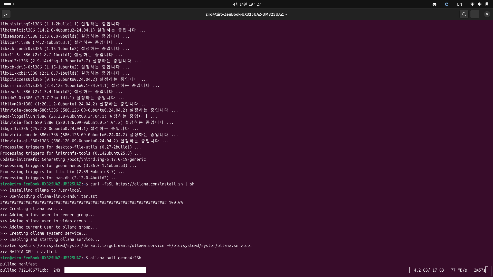

# 0. 들어가며

저는 최근 로컬 환경에서 LLM을 돌려보고 싶다는 생각이 들었습니다. 클라우드 API는 비용도 많이 들고, 데이터 프라이버시도 신경 쓰여서요. 그래서 우분투 머신에 Gemma 모델을 올리고 Hermes Agent와 연동해보기로 결심했습니다.

> 근데 모델 파일만 다운받으면 끝일 줄 알았어요. 어라, 이게 안 돌아가네?

처음엔 정말 막막했습니다. Gemma 모델 파일을 받았는데 어떻게 실행해야 하는지, Hermes Agent와는 어떻게 연결하는지 감이 안 왔거든요. 그래서 Gemini와 대화를 나누며 차근차근 정리해봤습니다.

---

# 1. 문제 상황: 모델 파일만으로는 부족하다

처음 제가 가진 것은 Gemma 모델의 가중치 파일뿐이었습니다.

> "모델 파일이 있으면 그걸로 충분하지 않을까?"

하지만 현실은 그렇지 않았습니다. LLM을 실행하려면 다음 세 가지가 필요합니다:

- **모델 파일** — 신경망의 가중치 데이터
- **추론 엔진(Inference Engine)** — 모델을 실제로 실행하는 소프트웨어
- **API 서버** — 모델과 애플리케이션을 연결하는 인터페이스

모델 파일 하나로는 아무것도 할 수 없다는 뜻입니다. 마치 자동차 엔진만 있고 엔진을 돌릴 스타터와 연료 공급 시스템이 없는 것처럼요.

---

# 2. 해결책: Ollama를 사용하자

Gemini와의 대화를 통해 알게 된 사실은, **Ollama**라는 도구를 쓰면 이 모든 것을 한 번에 해결할 수 있다는 것입니다.

Ollama는 다음을 자동으로 처리해줍니다:

- 모델 다운로드 (또는 기존 모델 인식)
- GPU/CPU 메모리 로드
- 추론 엔진 실행
- REST API 서버 자동 생성 (기본값: `http://localhost:11434`)

~~(정말 편한 친구입니다)~~

---

# 3. 단계별 설치 및 연동

## 3.1 Step 1: Ollama 설치

우분투 환경에서 Ollama를 설치합니다:

```bash
curl -fsSL https://ollama.ai/install.sh | sh
```

설치가 완료되면 Ollama 서비스를 시작합니다:

```bash
ollama serve
```

이 명령어를 실행하면 Ollama 서버가 포트 11434에서 대기합니다.


~~_Ollama가 정상적으로 시작되었습니다_~~

## 3.2 Step 2: Gemma 모델 실행

새로운 터미널 창에서 다음 명령어를 실행합니다:

```bash
ollama run gemma:7b
```

또는 더 가벼운 버전:

```bash
ollama run gemma2
```

~~(여러분의 GPU 메모리가 충분하다면 27b도 좋습니다)~~

모델이 처음 실행될 때는 다운로드와 메모리 로드 시간이 걸립니다. 커피 한 잔 마시고 기다리세요.


~~_모델이 메모리에 로드되고 있습니다_~~

## 3.3 Step 3: Hermes Agent 설치

다른 터미널에서 Hermes Agent를 설치합니다:

```bash
pip install hermes-agent
```

설치 후 초기 설정을 합니다:

```bash
hermes setup
```

이 명령어를 실행하면 대화형 설정 마법사가 시작됩니다.

> "어떤 모델을 사용할 거냐고요?"

설정 중에 모델 선택 질문이 나옵니다. 여기서는 **로컬 모델**을 선택하고, 엔드포인트를 `http://localhost:11434`로 지정합니다.


~~_hermes setup 대화형 인터페이스_~~


~~_로컬 모델 선택_~~


~~_Ollama 엔드포인트 지정_~~

## 3.4 Step 4: 연동 확인

설정이 완료되면 실제로 동작하는지 확인합니다:

```bash
hermes test
```

또는 간단한 파이썬 스크립트로 테스트할 수 있습니다:

```python
from hermes_agent import Agent

agent = Agent()
response = agent.ask("안녕하세요, 당신은 누구인가요?")
print(response)
```

정상적으로 응답이 오면 성공입니다!


~~_모델의 첫 응답_~~

---

# 4. 주의사항 및 트러블슈팅

### GPU 메모리 부족

모델이 로드되지 않으면 메모리 부족일 가능성이 높습니다:

```bash
nvidia-smi
```

명령어로 현재 GPU 상태를 확인하세요. 메모리가 부족하면 더 작은 모델을 선택합니다:

- **gemma:2b** — 가장 가벼움 (2GB)
- **gemma:7b** — 권장 (7GB)
- **gemma2:9b** — 중간 (9GB)
- **gemma2:27b** — 무거움 (27GB+)

### 포트 충돌

Ollama가 이미 포트 11434를 사용 중이면:

```bash
lsof -i :11434
```

로 확인하고, 필요하면 프로세스를 종료합니다:

```bash
kill -9 <PID>
```

### 권한 문제

Ollama 설치 후 권한 문제가 발생할 수 있습니다:

```bash
sudo usermod -aG docker $USER
```

명령어로 현재 사용자를 docker 그룹에 추가합니다.

---

# 5. 추가 팁: 성능 최적화

### 모델 캐싱

한 번 로드된 모델은 메모리에 캐시됩니다. 다음 실행은 훨씬 빠릅니다.

```bash
ollama list
```

로 설치된 모델 목록을 확인할 수 있습니다.


~~_여러 버전의 Gemma가 설치되어 있습니다_~~

### CPU 폴백

GPU가 부족하면 CPU에서도 실행 가능합니다. 다만 속도는 훨씬 느립니다:

```bash
OLLAMA_CPU_ONLY=1 ollama run gemma:7b
```

### 배치 처리

여러 요청을 한 번에 처리할 때는 배치 크기를 조정합니다:

```bash
OLLAMA_BATCH_SIZE=64 ollama serve
```

---

# 6. 실제 사용 예제

Hermes Agent를 통해 실제로 무엇을 할 수 있는지 보여드리겠습니다.

```python
from hermes_agent import Agent

agent = Agent()

# 1. 텍스트 생성
response = agent.ask("파이썬으로 피보나치 수열을 구하는 함수를 작성해주세요")
print(response)

# 2. 질문 응답
qa = agent.ask("2024년의 대통령은 누구인가요?")
print(qa)

# 3. 코드 분석
code_review = agent.ask("""
def add(a, b):
    return a + b

이 함수의 문제점을 지적해주세요
""")
print(code_review)
```


~~_Hermes Agent의 응답들_~~

---

# 7. 마무리

처음엔 "모델 파일만 있으면 되지 않을까?"라는 순진한 생각으로 시작했습니다. 하지만 추론 엔진의 중요성을 깨달았습니다. 

**Ollama는 정말 훌륭한 선택입니다:**

- ✅ 설치가 간단하다
- ✅ 모델 관리가 직관적이다
- ✅ API 서버가 자동으로 생성된다
- ✅ 다양한 모델을 쉽게 전환할 수 있다

여러분도 로컬 환경에서 LLM을 돌려보고 싶다면, 이 가이드를 따라 차근차근 진행하시면 됩니다. 처음엔 막막하겠지만, 한 번 설정해두면 정말 편합니다.

> 새로운 기술이 두렵지 않습니다. 차근차근 따라가면 결국 이해하게 되니까요.

행운을 빕니다! 🚀